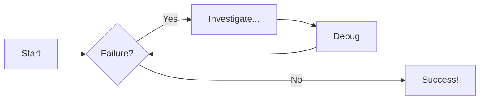

# Material for MkDocs: from zero to a published docs portal

A written version of James Willett's tutorial
[Material for MkDocs: Full Tutorial To Build And Deploy Your Docs Portal](https://www.youtube.com/watch?v=xlABhbnNrfI)
(Sept 2024, 27 min), brought up to date for 2026 and extended with a GitLab Pages variant.
His own written guide and repo: [jameswillett.dev](https://jameswillett.dev/getting-started-with-material-for-mkdocs/),
[material-mkdocs-youtube-2024](https://github.com/james-willett/material-mkdocs-youtube-2024).

The finished result of every step is in [`example/`](example/). Build it with
`pip install -r requirements.txt && mkdocs serve` and compare as you go.

## Contents

1. [MkDocs vs Material for MkDocs](#1-mkdocs-vs-material-for-mkdocs)
2. [Prerequisites](#2-prerequisites)
3. [Install and first run](#3-install-and-first-run)
4. [Schema validation in VS Code](#4-schema-validation-in-vs-code)
5. [Colour scheme and dark mode toggle](#5-colour-scheme-and-dark-mode-toggle)
6. [Fonts](#6-fonts)
7. [Emoji, icons, logo and favicon](#7-emoji-icons-logo-and-favicon)
8. [Code blocks](#8-code-blocks)
9. [Content tabs](#9-content-tabs)
10. [Admonitions](#10-admonitions)
11. [Mermaid diagrams](#11-mermaid-diagrams)
12. [Footer, social links, copyright](#12-footer-social-links-copyright)
13. [Publish to GitHub Pages](#13-publish-to-github-pages)
14. [Publish to GitLab Pages](#14-publish-to-gitlab-pages)
15. [2026 notes: pinning, maintenance mode, Zensical](#15-2026-notes-pinning-maintenance-mode-zensical)
16. [Where to go next](#16-where-to-go-next)

## 1. MkDocs vs Material for MkDocs

MkDocs is a static site generator for documentation: Markdown in, HTML out, plain
theme. Material for MkDocs is a theme on top of it that also ships plugins and Markdown
extensions: search, dark mode, code annotations, tabs, admonitions, social cards, a blog.
You install Material and get MkDocs as a dependency. Everything below is Material.

## 2. Prerequisites

- Python 3.9 or later (3.12 used here). `pip` comes with it.
- An editor. VS Code is used for the schema step; anything works for the rest.
- git, and a GitHub or GitLab account for the publishing steps.

Commands are for macOS/Linux. On Windows use `where python` for `which python` and
`.venv\Scripts\activate` for the activation line.

## 3. Install and first run

```bash
mkdir my-docs && cd my-docs
python3 -m venv .venv && source .venv/bin/activate
pip install "mkdocs-material==9.7.*" "mkdocs<2"   # why the pins: section 15
mkdocs new .
```

`mkdocs new .` creates `mkdocs.yml` and `docs/index.md`. Replace `mkdocs.yml` with the
minimum Material config:

```yaml
site_name: Example Docs Portal
site_url: https://example.com/docs/
theme:
  name: material
```

Run the dev server and open <http://127.0.0.1:8000>:

```bash
mkdocs serve
```

It rebuilds on every save, so keep it running in a second terminal for the rest of the
tutorial.

## 4. Schema validation in VS Code

`mkdocs.yml` grows fast and YAML fails quietly. Material publishes a JSON schema; with
the Red Hat YAML extension installed, add this to VS Code's `settings.json` and every key
gets hover documentation and typos get underlined:

```json
"yaml.schemas": {
  "https://squidfunk.github.io/mkdocs-material/schema.json": "mkdocs.yml"
},
"yaml.customTags": [
  "!ENV scalar",
  "!ENV sequence",
  "!relative scalar",
  "tag:yaml.org,2002:python/name:material.extensions.emoji.to_svg",
  "tag:yaml.org,2002:python/name:material.extensions.emoji.twemoji",
  "tag:yaml.org,2002:python/name:pymdownx.superfences.fence_code_format"
]
```

The `customTags` list stops the extension flagging the `!!python/name:` tags that the
emoji and Mermaid config use later.

## 5. Colour scheme and dark mode toggle

A single scheme is one line under `theme`:

```yaml
theme:
  name: material
  palette:
    scheme: slate        # dark; "default" is light
    primary: green
    accent: deep purple
```

A toggle is two palette entries, each naming the icon that switches to the other:

```yaml
theme:
  name: material
  palette:
    # Dark mode
    - scheme: slate
      toggle:
        icon: material/weather-sunny
        name: Switch to light mode
      primary: green
      accent: deep purple
    # Light mode
    - scheme: default
      toggle:
        icon: material/weather-night
        name: Switch to dark mode
      primary: blue
      accent: deep orange
```

`primary` colours the header and links; `accent` colours hover and focus states. Custom
colours and following the OS preference are in the Material docs under *Changing the
colors*.

## 6. Fonts

Any Google Font by name, one for text and one for code:

```yaml
theme:
  font:
    text: Merriweather Sans
    code: Red Hat Mono
```

Fonts are loaded from Google at page view. For an offline or privacy-constrained site set
`font: false` and ship your own; the docs cover that under *Changing the fonts*.

## 7. Emoji, icons, logo and favicon

Enable the emoji extension:

```yaml
markdown_extensions:
  - attr_list
  - pymdownx.emoji:
      emoji_index: !!python/name:material.extensions.emoji.twemoji
      emoji_generator: !!python/name:material.extensions.emoji.to_svg
```

Then `:beer:` and `:soccer:` render as emoji, and the bundled icon sets render with the
same syntax: `:material-check-circle:`, `:fontawesome-brands-github:`, `:octicons-repo-16:`.
Material's icon search lists all 10,000-odd of them.

An icon as the site logo:

```yaml
theme:
  icon:
    logo: fontawesome/solid/book
```

An image instead, plus a favicon. Put the files under `docs/assets/`:

```yaml
theme:
  logo: assets/logo.png
  favicon: assets/favicon.ico
```

## 8. Code blocks

Highlighting needs these extensions:

```yaml
markdown_extensions:
  - pymdownx.highlight:
      anchor_linenums: true
      line_spans: __span
      pygments_lang_class: true
  - pymdownx.inlinehilite
  - pymdownx.snippets
  - pymdownx.superfences
```

Name the language after the fence. `title`, `linenums` and `hl_lines` are optional:

````markdown
```py title="add_numbers.py" linenums="1"
def add_two_numbers(num1, num2):
    return num1 + num2
```

```js title="concat.js" linenums="1" hl_lines="2-4"
function concatenateStrings(str1, str2) {
  return str1 + str2;
}
```
````

Language names are Pygments lexer aliases: <https://pygments.org/docs/lexers/>. Add
`content.code.copy` under `theme.features` for a copy button on every block.

## 9. Content tabs

```yaml
markdown_extensions:
  - pymdownx.superfences
  - pymdownx.tabbed:
      alternate_style: true
```

Each tab is `=== "Label"` with its body indented four spaces. Code fences inside tabs
need the same indent:

````markdown
=== "Python"

    ```py
    print("Hello world!")
    ```

=== "JavaScript"

    ```js
    console.log("Hello world!");
    ```
````

## 10. Admonitions

```yaml
markdown_extensions:
  - admonition
  - pymdownx.details
  - pymdownx.superfences
```

`!!!` is a fixed block, `???` is collapsible (`???+` starts open). The word after the
marker is the type, the quoted string is an optional title:

```markdown
!!! note "Title of the callout"

    Body, indented four spaces.

??? info "Collapsible callout"

    Hidden until opened.
```

Types: `note`, `abstract`, `info`, `tip`, `success`, `question`, `warning`, `failure`,
`danger`, `bug`, `example`, `quote`.

## 11. Mermaid diagrams

Extend the `superfences` entry from section 8 with a custom fence. This replaces the
plain `- pymdownx.superfences` line:

```yaml
markdown_extensions:
  - pymdownx.superfences:
      custom_fences:
        - name: mermaid
          class: mermaid
          format: !!python/name:pymdownx.superfences.fence_code_format
```

Then a fenced block with language `mermaid` renders in the browser:

````markdown

````

Flowcharts, sequence, state, class and ER diagrams all work. Material bundles the Mermaid
runtime, so nothing extra to install.

## 12. Footer, social links, copyright

```yaml
theme:
  features:
    - navigation.footer      # previous/next links on every page

extra:
  social:
    - icon: simple/github
      link: https://github.com/djlongy
    - icon: simple/youtube
      link: https://youtube.com/@james-willett

copyright: Copyright &copy; 2026 Example Docs
```

The `simple/` icon set is Simple Icons: any brand you can think of.

## 13. Publish to GitHub Pages

Material's `mkdocs gh-deploy` builds the site and pushes it to a `gh-pages` branch. A
workflow does that on every push to `main`. Create `.github/workflows/ci.yml`
([full file](example/.github/workflows/ci.yml)):

```yaml
name: ci
on:
  push:
    branches: [main]
permissions:
  contents: write
jobs:
  deploy:
    runs-on: ubuntu-latest
    steps:
      - uses: actions/checkout@v4
      - name: Configure Git Credentials
        run: |
          git config user.name github-actions[bot]
          git config user.email 41898282+github-actions[bot]@users.noreply.github.com
      - uses: actions/setup-python@v5
        with:
          python-version: 3.x
      - run: echo "cache_id=$(date --utc '+%V')" >> $GITHUB_ENV
      - uses: actions/cache@v4
        with:
          key: mkdocs-material-${{ env.cache_id }}
          path: .cache
          restore-keys: |
            mkdocs-material-
      - run: pip install -r requirements.txt
      - run: mkdocs build --strict
      - run: mkdocs gh-deploy --force
```

Two additions over the video's workflow: dependencies come from `requirements.txt` so the
pins in section 15 apply in CI too, and `mkdocs build --strict` runs first so a broken
link fails the job instead of publishing a 404.

Then:

```bash
git init && git add . && git commit -m "Initial docs site"
git remote add origin git@github.com:<you>/<repo>.git
git push -u origin main
```

After the first workflow run: repository *Settings > Pages > Source: Deploy from a
branch > Branch: gh-pages*. The site appears at `https://<you>.github.io/<repo>/` within a
minute. Set `site_url` in `mkdocs.yml` to that address so canonical links and the sitemap
are right.

`.gitignore` for the repo: `.venv/`, `site/`, `.cache/`.

## 14. Publish to GitLab Pages

GitLab has no `gh-deploy`; a job named `pages` that leaves the site in `public/` as an
artifact is the whole mechanism. `.gitlab-ci.yml` ([full file](example/.gitlab-ci.yml)):

```yaml
image: python:3.12-slim
stages: [test, deploy]

.mkdocs:
  before_script:
    - pip install -r requirements.txt

lint:
  extends: .mkdocs
  stage: test
  script:
    - mkdocs build --strict -d public
  rules:
    - if: $CI_PIPELINE_SOURCE == "merge_request_event"
    - if: $CI_COMMIT_BRANCH && $CI_COMMIT_BRANCH != $CI_DEFAULT_BRANCH

pages:
  extends: .mkdocs
  stage: deploy
  script:
    - mkdocs build --strict -d public
  artifacts:
    paths: [public]
  rules:
    - if: $CI_COMMIT_BRANCH == $CI_DEFAULT_BRANCH
```

Merge requests get the strict build as a check; merges to the default branch publish. On
a self-hosted instance Pages has to be enabled by the admin (`pages_external_url` in
`gitlab.rb`); the project's URL is under *Deploy > Pages*.

## 15. 2026 notes: pinning, maintenance mode, Zensical

The video predates three changes that affect a new site today:

- Upstream **MkDocs has had no release since 1.6.1 (Aug 2024)**, and the announced
  MkDocs 2.0 removes the plugin system that Material depends on.
- **Material for MkDocs entered maintenance mode with 9.7.0 (Nov 2025)** and its
  maintainers state support ends on **5 Nov 2026**
  ([announcement](https://squidfunk.github.io/mkdocs-material/blog/2025/11/05/zensical/),
  [EOL issue](https://github.com/squidfunk/mkdocs-material/issues/8523)).
- The same team's successor, **[Zensical](https://zensical.org)**, reads `mkdocs.yml`
  natively. `pip install zensical && zensical build` on the example in this folder
  produces the same site (tested with Zensical 0.0.60).

So: pin `mkdocs<2` and `mkdocs-material==9.7.*` (the example's `requirements.txt`
does), keep an eye on Zensical's 1.0, and plan the switch before November 2026. Nothing
in this tutorial needs to change for it beyond the install line and the build command.

## 16. Where to go next

- `mkdocs build --strict` in CI turns broken links and missing pages into failures.
- [`mkdocs-awesome-pages-plugin`](https://github.com/lukasgeiter/mkdocs-awesome-pages-plugin)
  lets each folder order its own nav with a `.pages` file instead of one giant `nav:`.
- `markdownlint-cli2` and `lychee` as MR checks keep the Markdown and the links honest.
- Material's *Setup* section covers search tuning, navigation tabs and sections, versioning
  with `mike`, and social cards.
