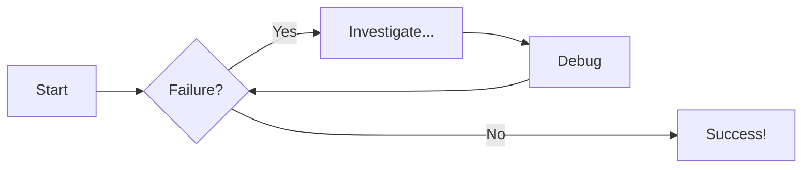
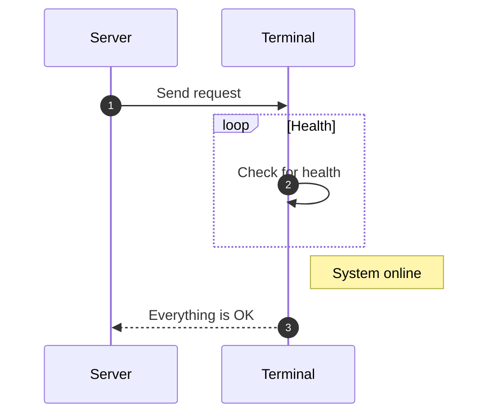

# Diagrams

Mermaid diagrams are written as text and rendered in the browser, so they live in the
same Markdown file as the prose and diff cleanly.

## Flowchart

## Sequence diagram

Other diagram types (state, class, entity-relationship, Gantt) use the same fence.
